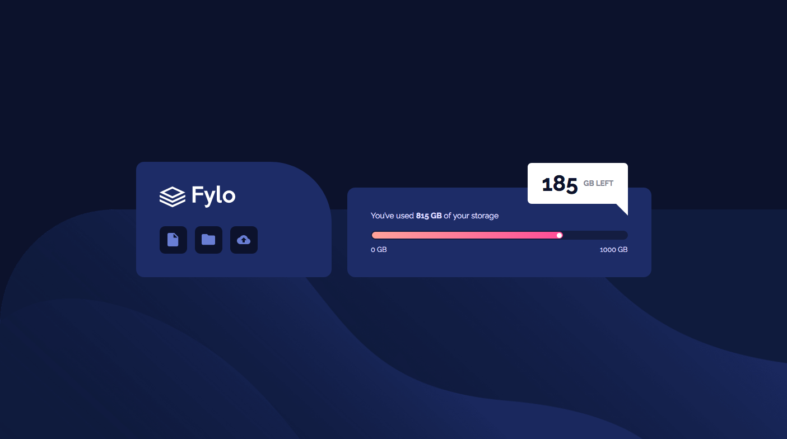
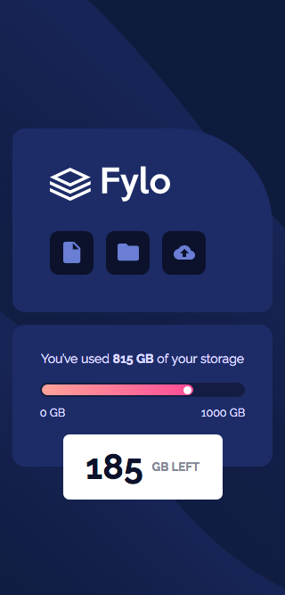

# Frontend Mentor - Fylo data storage component solution

This is a solution to the [Fylo data storage component challenge on Frontend Mentor](https://www.frontendmentor.io/challenges/fylo-data-storage-component-1dZPRbV5n). Frontend Mentor challenges help you improve your coding skills by building realistic projects.

## Overview

### The challenge

Users should be able to:

- View the optimal layout for the site depending on their device's screen size

### Screenshot

### Links

- [Solution](https://www.frontendmentor.io/solutions/fylo-data-storage-component-with-scss-and-flexbox-KZq0kUD0a#comment-611e774e30d21659ace4dd9a)
- [Live Site](https://filippo-b.github.io/fylo-data-storage-component/)

## My process

### Built with

- Semantic HTML5 markup
- CSS custom properties
- Flexbox
- Mobile-first workflow
- SCSS

## Author

- Frontend Mentor - [@Filippo-B](https://www.frontendmentor.io/profile/Filippo-B)
